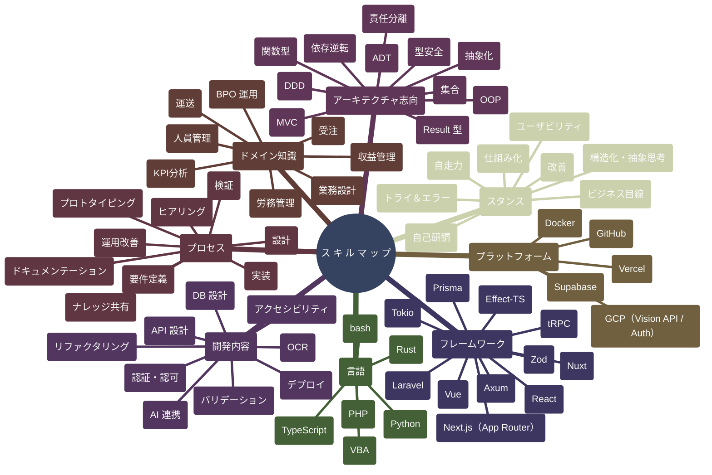
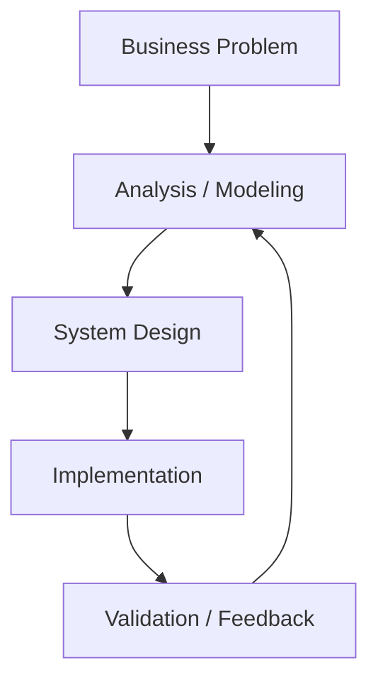
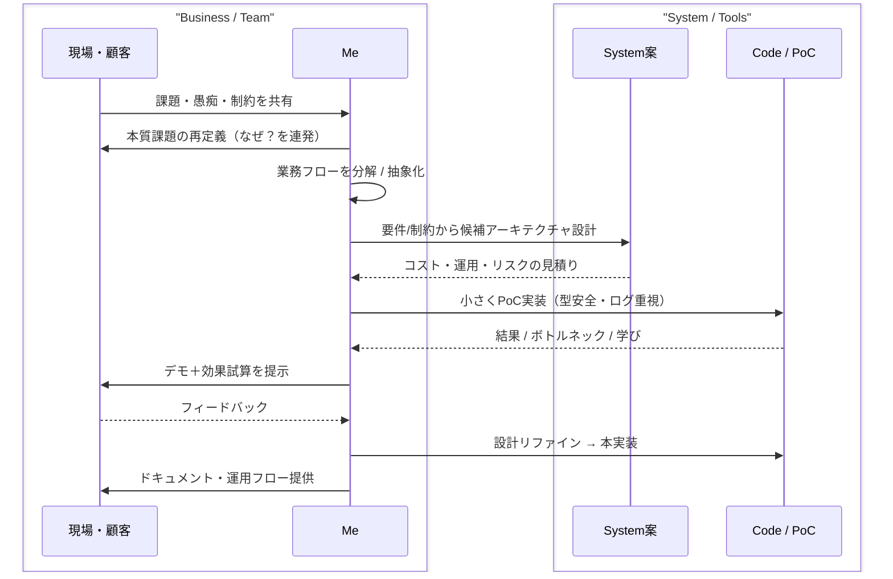

# README of Me

---

## 💻 Quick Start
```bash
~$ head -n 1 README.md
  "Just read mino2506.md — it’s my resume."

~$ file mino2506.md
  mino2506: human-readable system architect

~$ stat mino2506.md
  Created: 1993-**-**
  Updated: 2025-11-08
  Size: adaptive
  Mode: 0755

~$ cat mino2506.md

  ...

```

---

## 🧭 こんなコトをしてます - 概要 / Overview
BPO業務設計と自動化の経験を基盤に、  
Webアプリケーション設計・開発へ転向したいエンジニア。  
業務最適化の知見とモダンWeb技術を組み合わせ、
仕組みで問題を解決するアプローチを取る。

---

## 🧰 こんな技術がつかえます - 技術スタック / Tech Stack
|Category	| Technologies|
|---|---|
|Frontend |	TypeScript / Next.js / shadcn/ui |
|Backend |	Supabase / Prisma / tRPC |
|Infra |	Docker / GCP (Cloud Vision API) |
|AI |	OpenAI API (Structured Extraction) |
|DevOps	 |GitHub Actions / Bun Test |
|Legacy Integration	| Kintone / SmartRead / VBA Automation|



---

## 🧠 こんな風に考えます - アーキテクチャ / Architecture


---

## ⚙️ こんな風に働きます - 処理モデル / Process Model


---

## 💡 こんな価値を提供します - Core Values
- 自走力 / Self-Driven  
  与えられた仕事をこなすだけでなく、自ら課題を見つけて行動に移せます。  
  目的を理解し、必要な情報を自分で調べて改善策を実行することを得意としています。

- 改善志向 / Improvement-Oriented  
  効率化の結果に満足せず、より良い方法を常に探し続けます。  
  業務の中で見落とされがちな無駄や手作業を発見し、構造から見直すことを意識しています。

- 学習意欲 / Curious Learner  
  技術を学ぶこと自体が好きで、仕組みを理解し再設計する過程に楽しさを感じます。  
  VBA・Python・JavaScript・Next.jsなどを独学で習得し、実務にも活かしています。

## 🧾 こんな仕事をしてきました - 稼働ログ / Activity Logs

### 🧩 ローコード開発のための Excel "MVC風" アーキテクチャ / Excel "MVC-like” architecture for low-code automation
1. 状況 / Situation
    BPO業務の特性上、システムの統合やツールの横展開が困難だった。
    また、その多くがExcel上の手作業で行われており、
    属人的なマクロや関数依存による保守負荷が高かった。

3. タスク / Task
    - Excelを「設計可能なプラットフォーム」として再定義。
    - 再利用性と保守性を両立する内部構造の設計。

4. 実行 / Action
    - Excelの機能をMVCモデルに再構築：  
      PowerQuery → Model（データ抽象）  
      数式シート → View（動的表現）  
      VBA → Controller（制御・イベント駆動）  
    - 非エンジニアでも改修可能な構成を確立。
    - チーム共有向けにドキュメント化を整備。

5. 結果 / Result
    - ツール開発期間を大幅短縮（1か月 -> 1週間）。
    - 新規の市民開発者の獲得（4名）
    - ドキュメント配布 & 社内発表 によるナレッジ化。

### 🔍 OCR ツール導入プロジェクト / OCR Tools Implementation Project 
1. 状況 / Situation
    会社主導のOCR導入プロジェクトにおいて、
    KintoneとSmartReadを用いた伝票自動化の設計に参画。
    ただし方針段階から「マスタ保守や人力I/O残存」の構造的課題を認識。

2. タスク / Task
    - 導入計画の推進。
    - 既定設計のリスク分析。
    - 効率化が成立しない構造的要因を特定。
    - 次期プロジェクトへの知見蓄積を目的に検証設計を担当。

3. 実行 / Action
    - 再利用可能で効率性を意識した導入方法の計画と実行。
    - 現行設計をモデル化し、処理・保守コストの分析。
    - Node.jsでSmartReadのOCR結果を整形する自動検証ツールを開発。
    - マスタ保守最適化のための「更新自動化ロジック」を提案。

4. 結果 / Result
    - 1年間停滞していたプロジェクトの導入に成功。
    - 業務要件と技術実装の乖離を定量的に示すレポートを作成。
    - 次期システム設計の交渉材料として本部へ提出。

### 🧾 レシート OCR / Receipt OCR
1. 状況 / Situation
    社内OCRツール（SmartRead）では精度・柔軟性に限界があり、
    自動化業務の展開スピードが低下していた。
    現行フローを見直し、「AIを活用した構造化抽出」の可能性を検証。

2. タスク / Task
    - 技術をキャッチアップする。  
      どんな技術で何が可能なのかを調査し利用方法を学習。
    - OCR結果を構造化データとして整形。
    - 外部DBとの連携とUI管理を実現。
    - 既存ツールに依存しない自動化基盤を構築。

4. 実行 / Action
    - Next.js × Supabase × OpenAI API × Cloud Vision API を使用し、  
      画像を直接 構造化JSON に変換するPoCを開発。
    - Zodでスキーマバリデーション、Prisma/tRPCで型安全なAPI層を構築。
    - AI精度を活かした汎用的な業務自動化フローを設計。

5. 結果 / Result
    - 非構造データを自動的にDB整形できる仕組みを実現。
    - BPOのOCR業務における「再利用可能な設計思想」を確立。
    - 個人開発としてGitHubリポジトリ・Vercelデモを公開。

---

## 🚀 こんな学びをしてみたい -  バックログ / Backlog
| Status | Topic | Notes |
|---------|--------|--------|
| 🟡 In Progress | DDD (Domain-Driven Design) | 深層設計と責務分離の実践 |
| 🟡 In Progress | Effect-TS | 型安全な副作用管理とFP設計の探求 |
| 🟡 In Progress | Rust Web API (Axum) | 実践的な型駆動設計を習得 |
| 🔵 Considering | Testing Strategy | 設計品質を維持するためのテスト体系化 |
| 🟢 Planned | OOP (Object-Oriented Programming) | 深層設計と責務分離の実践 |
| ⚪ Wishlist | - | - |

## 📎 Contributor / Thanks
| Name | Period | Note |
|------|---------|------|
| transcosmos inc. | 2018– | For shaping my mindset in problem-solving and business design |
| You | 2025– | For reading, reviewing, and maybe joining my next project |

```bash

  ...

~$ echo "Thanks for contributing to my journey." >> /dev/heart/.log

~$ exit
```

---
